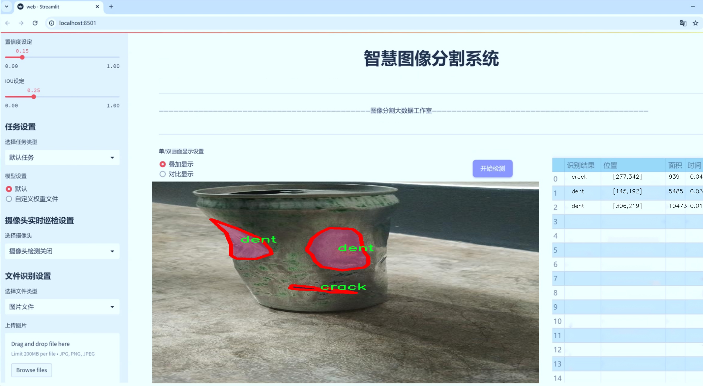
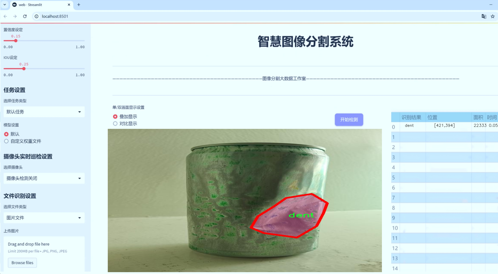
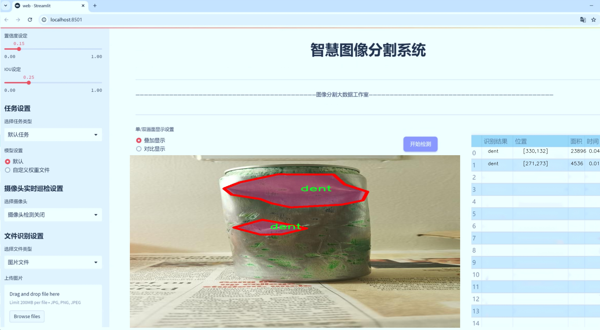
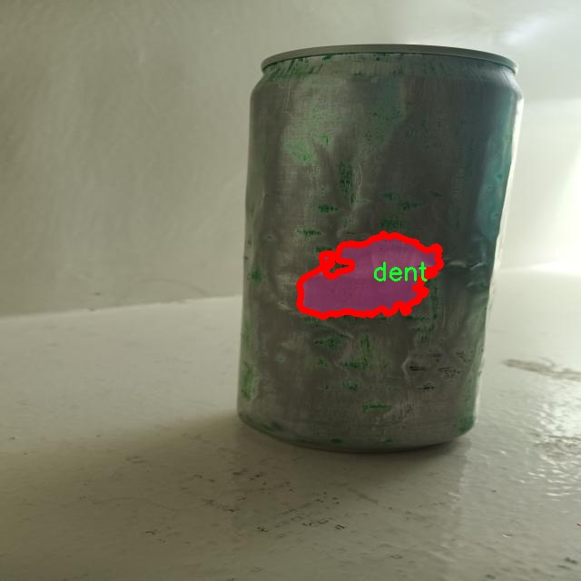
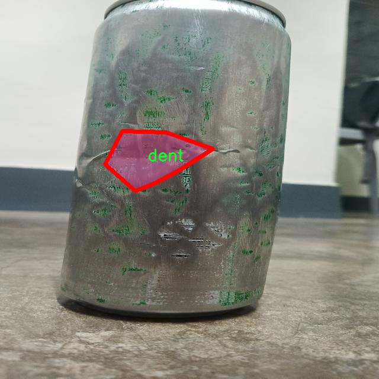

# 裂缝与凹痕分割系统源码＆数据集分享
 [yolov8-seg-C2f-EMSC＆yolov8-seg-RevCol等50+全套改进创新点发刊_一键训练教程_Web前端展示]

### 1.研究背景与意义

项目参考[ILSVRC ImageNet Large Scale Visual Recognition Challenge](https://gitee.com/YOLOv8_YOLOv11_Segmentation_Studio/projects)

项目来源[AAAI Global Al lnnovation Contest](https://kdocs.cn/l/cszuIiCKVNis)

研究背景与意义

随着城市化进程的加快，基础设施的建设与维护日益成为社会发展的重要课题。道路、桥梁、建筑物等基础设施在长期使用过程中，难免会出现裂缝与凹痕等损伤现象，这不仅影响了结构的美观，更可能对其安全性和使用寿命造成严重威胁。因此，及时、准确地检测和评估这些损伤，对于保障公共安全、延长基础设施的使用寿命、降低维护成本具有重要意义。

传统的裂缝与凹痕检测方法多依赖人工检查或简单的图像处理技术，这些方法不仅效率低下，而且容易受到人为因素的影响，导致检测结果的不准确。随着计算机视觉和深度学习技术的迅速发展，基于图像的自动检测与分割方法逐渐成为研究热点。其中，YOLO（You Only Look Once）系列模型因其高效的实时检测能力而被广泛应用于目标检测领域。YOLOv8作为该系列的最新版本，具备了更强的特征提取能力和更高的检测精度，适合用于复杂场景下的裂缝与凹痕检测。

本研究旨在基于改进的YOLOv8模型，构建一个高效的裂缝与凹痕分割系统。为此，我们利用了一个包含1100幅图像的数据集，该数据集专门针对裂缝与凹痕的实例分割任务，包含两个主要类别：裂缝和凹痕。通过对该数据集的深入分析与处理，我们可以为模型的训练提供丰富的样本，进而提升模型在实际应用中的表现。

本研究的意义在于，首先，通过改进YOLOv8模型，提升裂缝与凹痕的检测精度和速度，使得基础设施的损伤检测能够在更短的时间内完成，进而提高维护工作的效率。其次，基于深度学习的自动化检测系统能够减少人工检查的需求，降低人力成本，并降低因人为失误带来的风险。此外，准确的裂缝与凹痕检测能够为后续的结构健康监测和维护决策提供重要依据，促进基础设施的可持续发展。

最后，随着深度学习技术的不断进步，基于改进YOLOv8的裂缝与凹痕分割系统不仅具有理论研究的价值，也具备广泛的实际应用前景。该系统可推广至桥梁、道路、隧道等各类基础设施的检测中，为城市建设和管理提供智能化的解决方案。通过本研究，我们希望能够为基础设施的安全监测提供新的思路和方法，推动相关领域的技术进步与应用发展。

### 2.图片演示







##### 注意：由于此博客编辑较早，上面“2.图片演示”和“3.视频演示”展示的系统图片或者视频可能为老版本，新版本在老版本的基础上升级如下：（实际效果以升级的新版本为准）

  （1）适配了YOLOV8的“目标检测”模型和“实例分割”模型，通过加载相应的权重（.pt）文件即可自适应加载模型。

  （2）支持“图片识别”、“视频识别”、“摄像头实时识别”三种识别模式。

  （3）支持“图片识别”、“视频识别”、“摄像头实时识别”三种识别结果保存导出，解决手动导出（容易卡顿出现爆内存）存在的问题，识别完自动保存结果并导出到tempDir中。

  （4）支持Web前端系统中的标题、背景图等自定义修改，后面提供修改教程。

  另外本项目提供训练的数据集和训练教程,暂不提供权重文件（best.pt）,需要您按照教程进行训练后实现图片演示和Web前端界面演示的效果。

### 3.视频演示

[3.1 视频演示](https://www.bilibili.com/video/BV1DRmqYmEtn/)

### 4.数据集信息展示

##### 4.1 本项目数据集详细数据（类别数＆类别名）

nc: 2
names: ['crack', 'dent']


##### 4.2 本项目数据集信息介绍

数据集信息展示

在本研究中，我们采用了名为“Crack and Dent”的数据集，以训练和改进YOLOv8-seg模型，旨在实现高效的裂缝与凹痕分割系统。该数据集专注于两种主要类别的目标检测与分割，分别是“crack”（裂缝）和“dent”（凹痕），为模型提供了丰富的样本数据，以提高其在实际应用中的表现。

“Crack and Dent”数据集包含了大量经过精心标注的图像，这些图像展示了不同环境和条件下的裂缝与凹痕特征。每一张图像都经过专业人员的审核与标注，确保了数据的准确性和可靠性。数据集中裂缝的样本涵盖了各种形状、大小和深度，反映了在建筑、道路和其他基础设施中常见的裂缝类型。这些裂缝可能是由于材料老化、环境因素或结构性问题引起的，具有一定的复杂性和多样性。

与此同时，凹痕的样本同样丰富，涉及不同的物体表面，如金属、塑料和混凝土等。凹痕的特征同样多样，包括但不限于深度、形状和边缘的清晰度。这些样本的多样性使得模型在学习过程中能够更好地捕捉到凹痕的不同表现形式，从而提高其分割精度。

数据集的设计不仅考虑了类别的多样性，还注重了样本的数量和质量。每个类别的样本均经过精细的图像处理，确保在不同的光照条件和背景下，裂缝与凹痕的特征依然清晰可辨。这种高质量的标注和丰富的样本数量为YOLOv8-seg模型的训练提供了坚实的基础，使其能够在实际应用中有效识别和分割裂缝与凹痕。

在数据集的使用过程中，我们将其划分为训练集、验证集和测试集，以确保模型的泛化能力和性能评估的准确性。训练集用于模型的学习和参数调整，验证集用于模型的超参数优化，而测试集则用于最终的性能评估。通过这种方式，我们能够全面评估模型在裂缝与凹痕分割任务中的表现，并根据评估结果不断优化模型结构和训练策略。

此外，为了进一步提升模型的鲁棒性，我们还计划在数据集中引入数据增强技术。这些技术包括随机裁剪、旋转、翻转和颜色变换等，旨在增加数据的多样性，帮助模型更好地适应不同的实际场景。这一过程不仅能提高模型的准确性，还能增强其在复杂环境下的适应能力。

综上所述，“Crack and Dent”数据集为我们改进YOLOv8-seg模型提供了丰富的训练素材和良好的基础。通过对裂缝与凹痕的深入分析与学习，我们期望能够开发出一种高效、准确的分割系统，为相关领域的应用提供有力支持。






### 5.全套项目环境部署视频教程（零基础手把手教学）

[5.1 环境部署教程链接（零基础手把手教学）](https://www.bilibili.com/video/BV1jG4Ve4E9t/?vd_source=bc9aec86d164b67a7004b996143742dc)


[5.2 安装Python虚拟环境创建和依赖库安装视频教程链接（零基础手把手教学）](https://www.bilibili.com/video/BV1nA4VeYEze/?vd_source=bc9aec86d164b67a7004b996143742dc)

### 6.手把手YOLOV8-seg训练视频教程（零基础小白有手就能学会）

[6.1 手把手YOLOV8-seg训练视频教程（零基础小白有手就能学会）](https://www.bilibili.com/video/BV1cA4VeYETe/?vd_source=bc9aec86d164b67a7004b996143742dc)


按照上面的训练视频教程链接加载项目提供的数据集，运行train.py即可开始训练



     Epoch   gpu_mem       box       obj       cls    labels  img_size
     1/200     0G   0.01576   0.01955  0.007536        22      1280: 100%|██████████| 849/849 [14:42<00:00,  1.04s/it]
               Class     Images     Labels          P          R     mAP@.5 mAP@.5:.95: 100%|██████████| 213/213 [01:14<00:00,  2.87it/s]
                 all       3395      17314      0.994      0.957      0.0957      0.0843

     Epoch   gpu_mem       box       obj       cls    labels  img_size
     2/200     0G   0.01578   0.01923  0.007006        22      1280: 100%|██████████| 849/849 [14:44<00:00,  1.04s/it]
               Class     Images     Labels          P          R     mAP@.5 mAP@.5:.95: 100%|██████████| 213/213 [01:12<00:00,  2.95it/s]
                 all       3395      17314      0.996      0.956      0.0957      0.0845

     Epoch   gpu_mem       box       obj       cls    labels  img_size
     3/200     0G   0.01561    0.0191  0.006895        27      1280: 100%|██████████| 849/849 [10:56<00:00,  1.29it/s]
               Class     Images     Labels          P          R     mAP@.5 mAP@.5:.95: 100%|███████   | 187/213 [00:52<00:00,  4.04it/s]
                 all       3395      17314      0.996      0.957      0.0957      0.0845


### 7.50+种全套YOLOV8-seg创新点代码加载调参视频教程（一键加载写好的改进模型的配置文件）

[7.1 50+种全套YOLOV8-seg创新点代码加载调参视频教程（一键加载写好的改进模型的配置文件）](https://www.bilibili.com/video/BV1Hw4VePEXv/?vd_source=bc9aec86d164b67a7004b996143742dc)

### 8.YOLOV8-seg图像分割算法原理

原始YOLOv8-seg算法原理

YOLOv8-seg算法是YOLO系列目标检测模型的最新版本，专注于目标检测与分割任务的结合，体现了深度学习领域在计算机视觉方面的持续进步。该算法在YOLOv8的基础上进行了多项创新，旨在提高目标检测的精度和效率，同时引入了分割功能，使其能够在复杂场景中更好地识别和分割目标物体。

YOLOv8-seg的网络结构主要由三个部分组成：Backbone、Neck和Head。Backbone部分负责特征提取，采用了CSPDarknet结构，这是一种经过优化的深度学习网络架构。CSPDarknet将网络分为两个主要部分，每个部分都包含多个残差块，旨在提高特征提取的效率和准确性。与前代模型YOLOv5相比，YOLOv8-seg引入了C2f模块，替代了C3模块。C2f模块的设计理念是将输入特征图分为两个分支，每个分支经过卷积层进行降维处理，并通过堆叠多个分支形成更高维度的特征图。这种设计不仅增强了模型的梯度流信息，还提升了特征提取的能力，使得模型在面对复杂背景时，能够更好地捕捉到目标物体的特征。

在特征提取的过程中，YOLOv8-seg还采用了快速空间金字塔池化（SPPF）结构。这一结构能够有效提取不同尺度的特征，减少模型的参数量和计算量，同时提高特征提取的效率。通过对多尺度特征的有效利用，YOLOv8-seg能够在各种尺寸的目标物体上实现更好的检测效果，尤其是在处理小目标时，模型的表现得到了显著提升。

Neck部分则采用了特征金字塔网络（FPN）与路径聚合网络（PAN）的结合结构。这一结构通过多个卷积层和池化层对特征图进行处理和压缩，旨在增强特征的融合能力。特征金字塔网络通过自底向上的方式提取特征，并通过自顶向下的方式进行特征融合，从而实现多层次、多尺度的特征表示。而路径聚合网络则通过连接不同层次的特征图，进一步增强了模型对复杂场景的适应能力。这种特征融合的方式使得YOLOv8-seg在处理不同类型的目标时，能够更好地捕捉到目标的形状和位置。

在Head部分，YOLOv8-seg采用了解耦合头结构，将分类和检测任务分离。这一设计的核心在于将目标的分类和定位信息独立处理，使得模型在训练和推理过程中能够更加高效。与传统的Anchor-Based方法不同，YOLOv8-seg采用了Anchor-Free的检测方式，直接预测目标的中心点和宽高比例。这种方法不仅减少了Anchor框的数量，还提高了检测的速度和准确度，尤其在处理密集目标时，表现尤为突出。

在算法的训练过程中，YOLOv8-seg引入了动态样本分配策略，旨在优化训练过程中的样本选择。通过动态调整样本的分配，模型能够更好地适应不同的训练阶段，提升整体的训练效率。此外，在数据增强方面，YOLOv8-seg采用了更为灵活的策略，例如在训练的最后阶段关闭马赛克增强，以避免对模型学习的干扰。这些策略的引入，使得YOLOv8-seg在训练过程中能够更好地适应不同的数据集，提高了模型的泛化能力。

在损失计算方面，YOLOv8-seg采用了BCELoss作为分类损失，同时结合DFLLoss和CIoULoss作为回归损失。这种损失函数的组合，旨在提高模型在分类和定位任务上的表现，使得模型在面对复杂的目标检测和分割任务时，能够更好地优化其性能。

综上所述，YOLOv8-seg算法通过一系列创新的设计和优化，提升了目标检测与分割的性能。其高效的特征提取和融合机制、灵活的样本分配策略以及精确的损失计算方法，使得YOLOv8-seg在各种复杂场景中表现出色。作为YOLO系列的最新版本，YOLOv8-seg不仅在检测速度和准确度上超越了前代模型，还为目标检测与分割任务的结合提供了新的思路和方法，展现了深度学习在计算机视觉领域的广阔前景。


### 9.系统功能展示（检测对象为举例，实际内容以本项目数据集为准）

图9.1.系统支持检测结果表格显示

  图9.2.系统支持置信度和IOU阈值手动调节

  图9.3.系统支持自定义加载权重文件best.pt(需要你通过步骤5中训练获得)

  图9.4.系统支持摄像头实时识别

  图9.5.系统支持图片识别

  图9.6.系统支持视频识别

  图9.7.系统支持识别结果文件自动保存

  图9.8.系统支持Excel导出检测结果数据


### 10.50+种全套YOLOV8-seg创新点原理讲解（非科班也可以轻松写刊发刊，V11版本正在科研待更新）

#### 10.1 由于篇幅限制，每个创新点的具体原理讲解就不一一展开，具体见下列网址中的创新点对应子项目的技术原理博客网址【Blog】：


[10.1 50+种全套YOLOV8-seg创新点原理讲解链接](https://gitee.com/qunmasj/good)

#### 10.2 部分改进模块原理讲解(完整的改进原理见上图和技术博客链接)【如果此小节的图加载失败可以通过CSDN或者Github搜索该博客的标题访问原始博客，原始博客图片显示正常】
### CBAM空间注意力机制
近年来，随着深度学习研究方向的火热，注意力机制也被广泛地应用在图像识别、语音识别和自然语言处理等领域，注意力机制在深度学习任务中发挥着举足轻重的作用。注意力机制借鉴于人类的视觉系统，例如，人眼在看到一幅画面时，会倾向于关注画面中的重要信息，而忽略其他可见的信息。深度学习中的注意力机制和人类视觉的注意力机制相似，通过扫描全局数据，从大量数据中选择出需要重点关注的、对当前任务更为重要的信息，然后对这部分信息分配更多的注意力资源，从这些信息中获取更多所需要的细节信息，而抑制其他无用的信息。而在深度学习中，则具体表现为给感兴趣的区域更高的权重，经过网络的学习和调整，得到最优的权重分配，形成网络模型的注意力，使网络拥有更强的学习能力，加快网络的收敛速度。
注意力机制通常可分为软注意力机制和硬注意力机制[4-5]。软注意力机制在选择信息时，不是从输入的信息中只选择1个，而会用到所有输入信息，只是各个信息对应的权重分配不同，然后输入网络模型进行计算;硬注意力机制则是从输入的信息中随机选取一个或者选择概率最高的信息，但是这一步骤通常是不可微的，导致硬注意力机制更难训练。因此，软注意力机制应用更为广泛，按照原理可将软注意力机制划分为:通道注意力机制（channel attention)、空间注意力机制(spatial attention）和混合域注意力机制(mixed attention)。
通道注意力机制的本质建立各个特征通道之间的重要程度，对感兴趣的通道进行重点关注，弱化不感兴趣的通道的作用;空间注意力的本质则是建模了整个空间信息的重要程度，然后对空间内感兴趣的区域进行重点关注，弱化其余非感兴趣区域的作用;混合注意力同时运用了通道注意力和空间注意力，两部分先后进行或并行，形成对通道特征和空间特征同时关注的注意力模型。

卷积层注意力模块(Convolutional Block Attention Module，CBAM）是比较常用的混合注意力模块，其先后集中了通道注意力模块和空间注意力模块，网络中加入该模块能有效提高网络性能，减少网络模型的计算量，模块结构如图所示。输入特征图首先经过分支的通道注意力模块，然后和主干的原特征图融合，得到具有通道注意力的特征图，接着经过分支的空间注意力模块，在和主干的特征图融合后，得到同时具有通道特征注意力和空间特征注意力的特征图。CBAM模块不改变输入特征图的大小，因此该模块是一个“即插即用”的模块，可以插入网络的任何位置。

通道注意力模块的结构示意图如图所示，通道注意力模块分支并行地对输入的特征图进行最大池化操作和平均池化操作，然后利用多层感知机对结果进行变换，得到应用于两个通道的变换结果，最后经过sigmoid激活函数将变换结果融合，得到具有通道注意力的通道特征图。

空间注意力模块示意图如图所示，将通道注意力模块输出的特征图作为该模块的输入特征图，首先对输入特征图进行基于通道的最大池化操作和平均池化操作，将两部分得到的结果拼接起来，然后通过卷积得到降为Ⅰ通道的特征图，最后通过sigmoid激活函数生成具有空间注意力的特征图。


### 11.项目核心源码讲解（再也不用担心看不懂代码逻辑）

#### 11.1 ultralytics\models\sam\modules\sam.py

以下是经过精简和注释的核心代码部分：

```python
# 导入必要的库
from typing import List
import torch
from torch import nn

# 定义 Sam 类，用于对象分割任务
class Sam(nn.Module):
    """
    Sam (Segment Anything Model) 是一个用于对象分割的模型。它使用图像编码器生成图像嵌入，
    并使用提示编码器对各种类型的输入提示进行编码。这些嵌入随后被掩码解码器用于预测对象掩码。

    属性:
        mask_threshold (float): 掩码预测的阈值。
        image_format (str): 输入图像的格式，默认为 'RGB'。
        image_encoder (ImageEncoderViT): 用于将图像编码为嵌入的主干网络。
        prompt_encoder (PromptEncoder): 编码各种类型的输入提示。
        mask_decoder (MaskDecoder): 从图像和提示嵌入中预测对象掩码。
        pixel_mean (List[float]): 用于图像归一化的均值像素值。
        pixel_std (List[float]): 用于图像归一化的标准差值。
    """
    mask_threshold: float = 0.0  # 掩码预测的阈值初始化为0
    image_format: str = 'RGB'     # 默认图像格式为RGB

    def __init__(
        self,
        image_encoder: ImageEncoderViT,  # 图像编码器
        prompt_encoder: PromptEncoder,    # 提示编码器
        mask_decoder: MaskDecoder,        # 掩码解码器
        pixel_mean: List[float] = (123.675, 116.28, 103.53),  # 默认像素均值
        pixel_std: List[float] = (58.395, 57.12, 57.375)       # 默认像素标准差
    ) -> None:
        """
        初始化 Sam 类以根据图像和输入提示预测对象掩码。

        参数:
            image_encoder (ImageEncoderViT): 用于将图像编码为图像嵌入的主干网络。
            prompt_encoder (PromptEncoder): 编码各种类型的输入提示。
            mask_decoder (MaskDecoder): 从图像嵌入和编码提示中预测掩码。
            pixel_mean (List[float], optional): 输入图像归一化的均值值，默认为 (123.675, 116.28, 103.53)。
            pixel_std (List[float], optional): 输入图像归一化的标准差值，默认为 (58.395, 57.12, 57.375)。
        """
        super().__init__()  # 调用父类构造函数
        self.image_encoder = image_encoder  # 初始化图像编码器
        self.prompt_encoder = prompt_encoder  # 初始化提示编码器
        self.mask_decoder = mask_decoder      # 初始化掩码解码器
        # 注册均值和标准差为缓冲区，用于图像归一化
        self.register_buffer('pixel_mean', torch.Tensor(pixel_mean).view(-1, 1, 1), False)
        self.register_buffer('pixel_std', torch.Tensor(pixel_std).view(-1, 1, 1), False)
```

### 代码分析：
1. **类定义**：`Sam` 类是一个神经网络模型，继承自 `nn.Module`，用于对象分割任务。
2. **属性**：
   - `mask_threshold`：用于设置掩码预测的阈值。
   - `image_format`：指定输入图像的格式，默认为 RGB。
   - `image_encoder`、`prompt_encoder` 和 `mask_decoder` 分别用于图像编码、提示编码和掩码解码。
   - `pixel_mean` 和 `pixel_std` 用于图像的归一化处理，帮助提高模型的性能。
3. **构造函数**：初始化各个编码器和解码器，并注册均值和标准差作为模型的缓冲区，以便在前向传播时使用。

这个文件定义了一个名为 `Sam` 的类，它是一个用于对象分割任务的模型，属于 Ultralytics YOLO 项目的一部分。该模型的设计旨在通过图像编码器生成图像嵌入，并通过提示编码器对各种类型的输入提示进行编码，最终利用掩码解码器预测对象的掩码。

在类的属性中，`mask_threshold` 用于设置掩码预测的阈值，`image_format` 则指定输入图像的格式，默认为 'RGB'。`image_encoder` 是一个图像编码器（`ImageEncoderViT`），用于将图像编码为嵌入；`prompt_encoder` 是一个提示编码器（`PromptEncoder`），用于编码输入的提示信息；`mask_decoder` 是一个掩码解码器（`MaskDecoder`），用于根据图像和提示的嵌入预测对象的掩码。此外，`pixel_mean` 和 `pixel_std` 分别表示用于图像归一化的均值和标准差。

在 `__init__` 方法中，`Sam` 类的构造函数接收图像编码器、提示编码器和掩码解码器作为参数，并可以选择性地接收用于归一化的均值和标准差。构造函数首先调用父类的初始化方法，然后将传入的编码器和解码器赋值给相应的属性。最后，使用 `register_buffer` 方法注册了均值和标准差，这样它们就可以在模型的训练和推理过程中使用，而不会被视为模型的可训练参数。

总的来说，这个文件的主要功能是定义一个用于对象分割的模型框架，提供了必要的组件以便进行图像处理和掩码预测。

#### 11.2 ultralytics\utils\callbacks\base.py

以下是经过简化和注释的核心代码部分：

```python
# Ultralytics YOLO 🚀, AGPL-3.0 license
"""基础回调函数定义。"""

from collections import defaultdict
from copy import deepcopy

# 定义训练过程中的回调函数
def on_train_start(trainer):
    """训练开始时调用的回调函数。"""
    pass

def on_train_epoch_end(trainer):
    """每个训练周期结束时调用的回调函数。"""
    pass

def on_train_end(trainer):
    """训练结束时调用的回调函数。"""
    pass

# 定义验证过程中的回调函数
def on_val_start(validator):
    """验证开始时调用的回调函数。"""
    pass

def on_val_end(validator):
    """验证结束时调用的回调函数。"""
    pass

# 定义预测过程中的回调函数
def on_predict_start(predictor):
    """预测开始时调用的回调函数。"""
    pass

def on_predict_end(predictor):
    """预测结束时调用的回调函数。"""
    pass

# 定义导出过程中的回调函数
def on_export_start(exporter):
    """模型导出开始时调用的回调函数。"""
    pass

def on_export_end(exporter):
    """模型导出结束时调用的回调函数。"""
    pass

# 默认回调函数字典，包含各个阶段的回调函数
default_callbacks = {
    'on_train_start': [on_train_start],
    'on_train_epoch_end': [on_train_epoch_end],
    'on_train_end': [on_train_end],
    'on_val_start': [on_val_start],
    'on_val_end': [on_val_end],
    'on_predict_start': [on_predict_start],
    'on_predict_end': [on_predict_end],
    'on_export_start': [on_export_start],
    'on_export_end': [on_export_end]
}

def get_default_callbacks():
    """
    返回一个包含默认回调函数的字典副本。
    
    返回:
        (defaultdict): 一个包含默认回调函数的字典，默认值为空列表。
    """
    return defaultdict(list, deepcopy(default_callbacks))

def add_integration_callbacks(instance):
    """
    将来自不同来源的集成回调添加到实例的回调中。

    参数:
        instance (Trainer, Predictor, Validator, Exporter): 一个具有 'callbacks' 属性的对象，该属性是一个回调列表的字典。
    """
    # 加载集成回调
    from .hub import callbacks as hub_cb
    callbacks_list = [hub_cb]

    # 如果实例是训练器，则加载训练回调
    if 'Trainer' in instance.__class__.__name__:
        from .clearml import callbacks as clear_cb
        from .comet import callbacks as comet_cb
        callbacks_list.extend([clear_cb, comet_cb])

    # 将回调添加到回调字典中
    for callbacks in callbacks_list:
        for k, v in callbacks.items():
            if v not in instance.callbacks[k]:
                instance.callbacks[k].append(v)
```

### 代码说明：
1. **回调函数**：定义了一系列回调函数，用于在训练、验证、预测和导出过程中触发特定操作。
2. **默认回调字典**：`default_callbacks` 字典中存储了各个阶段的回调函数，便于管理和调用。
3. **获取默认回调**：`get_default_callbacks` 函数返回一个默认回调字典的副本，确保每次调用时都能得到一个新的字典。
4. **添加集成回调**：`add_integration_callbacks` 函数用于将其他来源的回调集成到当前实例的回调列表中，增强功能的灵活性和扩展性。

这个程序文件 `ultralytics/utils/callbacks/base.py` 是用于实现和管理回调函数的基础框架，主要用于深度学习模型的训练、验证、预测和导出过程中的不同阶段。文件中定义了一系列的回调函数，这些函数在特定的事件发生时被调用，以便用户可以在这些事件中插入自定义的操作。

首先，文件导入了 `defaultdict` 和 `deepcopy`，这两个模块分别用于创建一个具有默认值的字典和深拷贝对象。接下来，文件中定义了一系列回调函数，分为四个主要部分：训练回调、验证回调、预测回调和导出回调。

在训练回调部分，定义了多个函数，例如 `on_train_start`、`on_train_epoch_start`、`on_train_batch_start` 等。这些函数在训练的不同阶段被调用，例如在训练开始时、每个训练周期开始时、每个训练批次开始时等。每个函数的具体实现目前都是空的，意味着用户可以根据需要在这些函数中添加自定义的逻辑。

验证回调部分同样定义了一些函数，如 `on_val_start`、`on_val_batch_start` 和 `on_val_end`，这些函数在验证过程的不同阶段被调用。

预测回调部分包含了与预测相关的函数，例如 `on_predict_start` 和 `on_predict_end`，这些函数在进行模型预测时的不同阶段被调用。

导出回调部分则包括了 `on_export_start` 和 `on_export_end`，用于处理模型导出过程中的操作。

在文件的最后，定义了一个 `default_callbacks` 字典，它将所有的回调函数按类别组织起来，便于后续的调用和管理。`get_default_callbacks` 函数返回一个默认回调字典的深拷贝，确保在使用时不会修改原始的回调配置。

最后，`add_integration_callbacks` 函数用于将来自不同来源的集成回调添加到实例的回调字典中。它首先加载一些外部库的回调函数，然后根据传入的实例类型（如训练器、预测器、验证器或导出器）将相应的回调函数添加到实例的回调列表中。

总体来说，这个文件提供了一个灵活的框架，允许用户在模型训练、验证、预测和导出过程中插入自定义的逻辑，从而实现更好的控制和监控。

#### 11.3 ultralytics\nn\extra_modules\orepa.py

以下是代码中最核心的部分，并附上详细的中文注释：

```python
import torch
import torch.nn as nn
import torch.nn.functional as F
import numpy as np

# 定义OREPA模块
class OREPA(nn.Module):
    def __init__(self, in_channels, out_channels, kernel_size=3, stride=1, padding=None, groups=1, dilation=1, act=True):
        super(OREPA, self).__init__()
        
        # 初始化参数
        self.kernel_size = kernel_size
        self.in_channels = in_channels
        self.out_channels = out_channels
        self.groups = groups
        self.stride = stride
        self.padding = padding if padding is not None else (kernel_size // 2)
        self.dilation = dilation
        
        # 激活函数选择
        self.nonlinear = nn.ReLU() if act else nn.Identity()
        
        # 定义卷积层的权重参数
        self.weight_orepa_origin = nn.Parameter(torch.Tensor(out_channels, in_channels // groups, kernel_size, kernel_size))
        nn.init.kaiming_uniform_(self.weight_orepa_origin)  # 权重初始化
        
        # 定义其他卷积层的权重参数
        self.weight_orepa_avg_conv = nn.Parameter(torch.Tensor(out_channels, in_channels // groups, 1, 1))
        nn.init.kaiming_uniform_(self.weight_orepa_avg_conv)
        
        self.weight_orepa_1x1 = nn.Parameter(torch.Tensor(out_channels, in_channels // groups, 1, 1))
        nn.init.kaiming_uniform_(self.weight_orepa_1x1)

        # 初始化向量，用于加权不同分支的输出
        self.vector = nn.Parameter(torch.Tensor(3, out_channels))
        nn.init.constant_(self.vector[0, :], 1.0)  # origin
        nn.init.constant_(self.vector[1, :], 0.5)  # avg
        nn.init.constant_(self.vector[2, :], 0.5)  # 1x1

    def weight_gen(self):
        # 生成最终的卷积权重
        weight_orepa_origin = self.weight_orepa_origin * self.vector[0, :].view(-1, 1, 1, 1)
        weight_orepa_avg = self.weight_orepa_avg_conv * self.vector[1, :].view(-1, 1, 1, 1)
        weight_orepa_1x1 = self.weight_orepa_1x1 * self.vector[2, :].view(-1, 1, 1, 1)

        # 将不同分支的权重相加
        weight = weight_orepa_origin + weight_orepa_avg + weight_orepa_1x1
        return weight

    def forward(self, inputs):
        # 生成权重并进行卷积操作
        weight = self.weight_gen()
        out = F.conv2d(inputs, weight, stride=self.stride, padding=self.padding, dilation=self.dilation, groups=self.groups)
        return self.nonlinear(out)  # 应用激活函数

# 定义RepVGGBlock_OREPA模块
class RepVGGBlock_OREPA(nn.Module):
    def __init__(self, in_channels, out_channels, kernel_size=3, stride=1, padding=None, groups=1, act=True):
        super(RepVGGBlock_OREPA, self).__init__()
        
        # 初始化参数
        self.in_channels = in_channels
        self.out_channels = out_channels
        self.groups = groups
        self.padding = padding if padding is not None else (kernel_size // 2)
        
        # 激活函数选择
        self.nonlinearity = nn.ReLU() if act else nn.Identity()
        
        # 定义OREPA模块
        self.rbr_dense = OREPA(in_channels, out_channels, kernel_size=kernel_size, stride=stride, padding=self.padding, groups=groups)
        self.rbr_1x1 = nn.Conv2d(in_channels, out_channels, kernel_size=1, stride=stride, padding=0, groups=groups)

    def forward(self, inputs):
        # 计算不同分支的输出
        out1 = self.rbr_dense(inputs)  # OREPA分支
        out2 = self.rbr_1x1(inputs)    # 1x1卷积分支
        out = out1 + out2              # 将两个分支的输出相加
        return self.nonlinearity(out)  # 应用激活函数
```

### 代码注释说明：
1. **OREPA类**：
   - `__init__`方法中定义了输入输出通道、卷积核大小、步幅、填充、分组数等参数，并初始化了多个卷积层的权重。
   - `weight_gen`方法用于生成最终的卷积权重，通过加权不同分支的输出。
   - `forward`方法执行前向传播，使用生成的权重进行卷积操作，并应用激活函数。

2. **RepVGGBlock_OREPA类**：
   - 该类构建了一个包含OREPA模块和1x1卷积的复合模块。
   - `forward`方法计算两个分支的输出并将其相加，最后应用激活函数。

这些核心部分实现了自适应卷积的基本结构，适用于深度学习中的卷积神经网络。

这个程序文件 `orepa.py` 是一个用于构建深度学习模型的 PyTorch 模块，主要实现了一种名为 OREPA（One Reparameterization for Efficient and Powerful Architecture）的卷积层。该模块的设计目的是为了提高卷积神经网络的性能和效率，特别是在模型推理阶段。

文件中首先导入了必要的库，包括 PyTorch 的核心模块、数学库、NumPy 以及一些自定义的卷积模块和注意力机制模块。接着，定义了一些辅助函数，例如 `transI_fusebn` 和 `transVI_multiscale`，用于处理卷积核和批归一化层的融合以及多尺度卷积核的填充。

接下来，定义了 `OREPA` 类，该类继承自 `nn.Module`，实现了 OREPA 卷积层的核心逻辑。在初始化方法中，定义了多个参数，包括输入输出通道数、卷积核大小、步幅、填充、分组卷积、扩张率等。根据是否处于部署模式，类会选择不同的初始化方式。

在 `OREPA` 类中，主要的参数包括多种卷积核的权重，分别用于不同的卷积操作，如原始卷积、平均卷积、1x1 卷积等。权重的初始化使用了 Kaiming 初始化方法，以确保网络在训练初期的稳定性。此外，类中还定义了一个 `vector` 参数，用于在前向传播时加权不同的卷积核。

`weight_gen` 方法用于生成最终的卷积权重，通过对不同卷积核的权重进行加权和组合，形成最终的卷积核。在 `forward` 方法中，输入数据经过卷积操作后，应用非线性激活函数和批归一化层。

此外，文件中还定义了其他几个类，如 `OREPA_LargeConv`、`ConvBN` 和 `RepVGGBlock_OREPA`，这些类都是在不同的上下文中使用 OREPA 模块，提供了更复杂的网络结构和功能。`OREPA_LargeConv` 类实现了大卷积核的 OREPA 结构，而 `RepVGGBlock_OREPA` 则结合了 OREPA 和其他卷积层，形成一个更完整的模块。

总的来说，这个文件实现了一个灵活且高效的卷积模块，旨在通过重参数化技术提高卷积神经网络的性能，同时保持较低的计算复杂度，适合在各种深度学习任务中使用。

#### 11.4 ultralytics\models\yolo\pose\train.py

以下是经过简化和注释的核心代码部分：

```python
# 导入必要的库和模块
from copy import copy
from ultralytics.models import yolo
from ultralytics.nn.tasks import PoseModel
from ultralytics.utils import DEFAULT_CFG, LOGGER
from ultralytics.utils.plotting import plot_images, plot_results

class PoseTrainer(yolo.detect.DetectionTrainer):
    """
    PoseTrainer类，扩展了DetectionTrainer类，用于基于姿态模型的训练。
    """

    def __init__(self, cfg=DEFAULT_CFG, overrides=None, _callbacks=None):
        """初始化PoseTrainer对象，设置配置和覆盖参数。"""
        if overrides is None:
            overrides = {}
        overrides['task'] = 'pose'  # 设置任务类型为姿态估计
        super().__init__(cfg, overrides, _callbacks)  # 调用父类构造函数

        # 检查设备类型，如果是Apple MPS，给出警告
        if isinstance(self.args.device, str) and self.args.device.lower() == 'mps':
            LOGGER.warning("WARNING ⚠️ Apple MPS known Pose bug. Recommend 'device=cpu' for Pose models.")

    def get_model(self, cfg=None, weights=None, verbose=True):
        """获取姿态估计模型，使用指定的配置和权重。"""
        # 创建PoseModel实例
        model = PoseModel(cfg, ch=3, nc=self.data['nc'], data_kpt_shape=self.data['kpt_shape'], verbose=verbose)
        if weights:
            model.load(weights)  # 如果提供了权重，则加载权重

        return model  # 返回模型实例

    def set_model_attributes(self):
        """设置PoseModel的关键点形状属性。"""
        super().set_model_attributes()  # 调用父类的方法
        self.model.kpt_shape = self.data['kpt_shape']  # 设置关键点形状

    def get_validator(self):
        """返回PoseValidator类的实例，用于验证。"""
        self.loss_names = 'box_loss', 'pose_loss', 'kobj_loss', 'cls_loss', 'dfl_loss'  # 定义损失名称
        return yolo.pose.PoseValidator(self.test_loader, save_dir=self.save_dir, args=copy(self.args))  # 返回验证器实例

    def plot_training_samples(self, batch, ni):
        """绘制一批训练样本，包括类标签、边界框和关键点。"""
        images = batch['img']  # 获取图像
        kpts = batch['keypoints']  # 获取关键点
        cls = batch['cls'].squeeze(-1)  # 获取类标签
        bboxes = batch['bboxes']  # 获取边界框
        paths = batch['im_file']  # 获取图像文件路径
        batch_idx = batch['batch_idx']  # 获取批次索引
        # 绘制图像并保存
        plot_images(images,
                    batch_idx,
                    cls,
                    bboxes,
                    kpts=kpts,
                    paths=paths,
                    fname=self.save_dir / f'train_batch{ni}.jpg',
                    on_plot=self.on_plot)

    def plot_metrics(self):
        """绘制训练和验证指标。"""
        plot_results(file=self.csv, pose=True, on_plot=self.on_plot)  # 保存结果图像
```

### 代码注释说明：
1. **导入模块**：引入必要的库和模块以支持模型训练和数据处理。
2. **PoseTrainer类**：该类继承自`DetectionTrainer`，用于姿态估计模型的训练。
3. **初始化方法**：设置训练任务类型为姿态估计，并处理设备类型的警告。
4. **获取模型**：创建并返回姿态估计模型的实例，支持加载预训练权重。
5. **设置模型属性**：设置模型的关键点形状属性，以便在训练过程中使用。
6. **获取验证器**：返回用于验证模型性能的`PoseValidator`实例。
7. **绘制训练样本**：将一批训练样本可视化，包括图像、关键点和边界框，并保存为图像文件。
8. **绘制指标**：绘制训练和验证过程中的性能指标，便于分析模型效果。

这个程序文件是用于训练基于姿态模型的YOLO（You Only Look Once）算法的一个类，名为`PoseTrainer`，它继承自`DetectionTrainer`类。该类的主要功能是设置和管理姿态估计模型的训练过程。

在文件开头，首先导入了一些必要的模块和类，包括YOLO模型、姿态模型、默认配置、日志记录器以及用于绘图的工具。

`PoseTrainer`类的构造函数`__init__`接收配置参数、覆盖参数和回调函数。在初始化过程中，如果没有提供覆盖参数，则创建一个空字典，并将任务类型设置为“pose”。然后调用父类的构造函数进行初始化。此外，如果设备被设置为Apple的MPS（Metal Performance Shaders），则会发出警告，建议使用CPU进行姿态模型的训练。

`get_model`方法用于获取姿态估计模型。它接收配置和权重参数，并创建一个`PoseModel`实例。如果提供了权重，则会加载这些权重。

`set_model_attributes`方法用于设置姿态模型的关键点形状属性，这个属性是从数据集中获取的。

`get_validator`方法返回一个姿态验证器的实例，用于在训练过程中进行模型验证。它还定义了损失名称，包括边界框损失、姿态损失、关键对象损失、分类损失和分布式焦点损失。

`plot_training_samples`方法用于绘制一批训练样本，包括带有注释的类标签、边界框和关键点。它接收一个批次的数据，并使用`plot_images`函数将图像、关键点、类标签和边界框绘制到指定的文件中。

最后，`plot_metrics`方法用于绘制训练和验证过程中的指标，它调用`plot_results`函数来生成结果图。

总体而言，这个文件提供了一个完整的框架，用于训练和验证姿态估计模型，支持数据可视化和结果分析。

#### 11.5 ultralytics\utils\callbacks\__init__.py

以下是经过简化和详细注释的核心代码部分：

```python
# 导入必要的回调函数和工具
from .base import add_integration_callbacks, default_callbacks, get_default_callbacks

# 定义模块的公共接口，允许外部使用这些函数
__all__ = 'add_integration_callbacks', 'default_callbacks', 'get_default_callbacks'
```

### 代码注释说明：

1. **导入模块**：
   - `from .base import add_integration_callbacks, default_callbacks, get_default_callbacks`：从当前包的 `base` 模块中导入三个函数。这些函数可能用于集成回调、获取默认回调等功能。

2. **定义公共接口**：
   - `__all__` 是一个特殊变量，用于定义当使用 `from module import *` 时，哪些名称是可以被导入的。在这里，它包含了三个函数的名称，表示这些函数是模块的公共接口，外部可以直接使用。

通过这样的结构，代码的可读性和可维护性得到了提升，同时也清晰地定义了模块的功能和可用接口。

这个程序文件是一个Python模块，属于Ultralytics YOLO项目的一部分，使用AGPL-3.0许可证。文件的主要功能是导入和管理回调函数，这些回调函数通常用于训练模型时的各种操作和事件处理。

首先，文件通过相对导入的方式引入了三个函数：`add_integration_callbacks`、`default_callbacks`和`get_default_callbacks`，这些函数都来自于同一目录下的`base`模块。这种结构使得代码的组织更加清晰，便于维护和扩展。

接下来，`__all__`变量被定义为一个元组，包含了上述三个函数的名称。这意味着当使用`from ultralytics.utils.callbacks import *`这种方式导入模块时，只会导入`__all__`中列出的这些名称。这是一种控制模块导出内容的方式，确保用户只获取到特定的接口，避免不必要的名称冲突或误用。

总体而言，这个文件的作用是为Ultralytics YOLO项目提供回调函数的接口，方便其他模块或用户在训练过程中使用这些回调功能。

### 12.系统整体结构（节选）

### 整体功能和构架概括

Ultralytics YOLO项目是一个用于目标检测和姿态估计的深度学习框架，旨在提供高效、灵活的模型训练和推理功能。该项目的架构模块化，允许用户根据需求自定义和扩展功能。主要模块包括模型定义、训练管理、回调处理和额外的神经网络组件。

1. **模型定义**：如`sam.py`文件定义了用于对象分割的模型结构，提供了图像编码器、提示编码器和掩码解码器的组合。
2. **训练管理**：如`train.py`文件负责姿态估计模型的训练过程，管理数据加载、模型验证和可视化。
3. **回调处理**：如`base.py`和`__init__.py`文件提供了回调机制，允许用户在训练和验证过程中插入自定义逻辑，以便监控和调整训练过程。
4. **额外模块**：如`orepa.py`文件实现了高效的卷积层，旨在提高模型的性能和推理效率。

### 文件功能整理表

| 文件路径                                      | 功能描述                                                                                     |
|-------------------------------------------|------------------------------------------------------------------------------------------|
| `ultralytics/models/sam/modules/sam.py`  | 定义了用于对象分割的`Sam`模型，包括图像编码器、提示编码器和掩码解码器的组合。                          |
| `ultralytics/utils/callbacks/base.py`    | 实现了回调函数的基础框架，提供了训练、验证、预测和导出过程中的回调管理，允许用户自定义操作。                |
| `ultralytics/nn/extra_modules/orepa.py`  | 实现了OREPA卷积层，旨在提高卷积神经网络的性能和效率，包含多个卷积核的组合和重参数化技术。                 |
| `ultralytics/models/yolo/pose/train.py`   | 管理姿态估计模型的训练过程，包括模型初始化、验证、损失计算和训练样本的可视化。                          |
| `ultralytics/utils/callbacks/__init__.py` | 导入和管理回调函数，提供回调接口，便于其他模块在训练过程中使用这些回调功能。                              |

这个表格总结了每个文件的主要功能，展示了Ultralytics YOLO项目的模块化设计和各个组件之间的协作关系。

注意：由于此博客编辑较早，上面“11.项目核心源码讲解（再也不用担心看不懂代码逻辑）”中部分代码可能会优化升级，仅供参考学习，完整“训练源码”、“Web前端界面”和“50+种创新点源码”以“14.完整训练+Web前端界面+50+种创新点源码、数据集获取”的内容为准。

### 13.图片、视频、摄像头图像分割Demo(去除WebUI)代码

在这个博客小节中，我们将讨论如何在不使用WebUI的情况下，实现图像分割模型的使用。本项目代码已经优化整合，方便用户将分割功能嵌入自己的项目中。
核心功能包括图片、视频、摄像头图像的分割，ROI区域的轮廓提取、类别分类、周长计算、面积计算、圆度计算以及颜色提取等。
这些功能提供了良好的二次开发基础。

### 核心代码解读

以下是主要代码片段，我们会为每一块代码进行详细的批注解释：

```python
import random
import cv2
import numpy as np
from PIL import ImageFont, ImageDraw, Image
from hashlib import md5
from model import Web_Detector
from chinese_name_list import Label_list

# 根据名称生成颜色
def generate_color_based_on_name(name):
    ......

# 计算多边形面积
def calculate_polygon_area(points):
    return cv2.contourArea(points.astype(np.float32))

...
# 绘制中文标签
def draw_with_chinese(image, text, position, font_size=20, color=(255, 0, 0)):
    image_pil = Image.fromarray(cv2.cvtColor(image, cv2.COLOR_BGR2RGB))
    draw = ImageDraw.Draw(image_pil)
    font = ImageFont.truetype("simsun.ttc", font_size, encoding="unic")
    draw.text(position, text, font=font, fill=color)
    return cv2.cvtColor(np.array(image_pil), cv2.COLOR_RGB2BGR)

# 动态调整参数
def adjust_parameter(image_size, base_size=1000):
    max_size = max(image_size)
    return max_size / base_size

# 绘制检测结果
def draw_detections(image, info, alpha=0.2):
    name, bbox, conf, cls_id, mask = info['class_name'], info['bbox'], info['score'], info['class_id'], info['mask']
    adjust_param = adjust_parameter(image.shape[:2])
    spacing = int(20 * adjust_param)

    if mask is None:
        x1, y1, x2, y2 = bbox
        aim_frame_area = (x2 - x1) * (y2 - y1)
        cv2.rectangle(image, (x1, y1), (x2, y2), color=(0, 0, 255), thickness=int(3 * adjust_param))
        image = draw_with_chinese(image, name, (x1, y1 - int(30 * adjust_param)), font_size=int(35 * adjust_param))
        y_offset = int(50 * adjust_param)  # 类别名称上方绘制，其下方留出空间
    else:
        mask_points = np.concatenate(mask)
        aim_frame_area = calculate_polygon_area(mask_points)
        mask_color = generate_color_based_on_name(name)
        try:
            overlay = image.copy()
            cv2.fillPoly(overlay, [mask_points.astype(np.int32)], mask_color)
            image = cv2.addWeighted(overlay, 0.3, image, 0.7, 0)
            cv2.drawContours(image, [mask_points.astype(np.int32)], -1, (0, 0, 255), thickness=int(8 * adjust_param))

            # 计算面积、周长、圆度
            area = cv2.contourArea(mask_points.astype(np.int32))
            perimeter = cv2.arcLength(mask_points.astype(np.int32), True)
            ......

            # 计算色彩
            mask = np.zeros(image.shape[:2], dtype=np.uint8)
            cv2.drawContours(mask, [mask_points.astype(np.int32)], -1, 255, -1)
            color_points = cv2.findNonZero(mask)
            ......

            # 绘制类别名称
            x, y = np.min(mask_points, axis=0).astype(int)
            image = draw_with_chinese(image, name, (x, y - int(30 * adjust_param)), font_size=int(35 * adjust_param))
            y_offset = int(50 * adjust_param)

            # 绘制面积、周长、圆度和色彩值
            metrics = [("Area", area), ("Perimeter", perimeter), ("Circularity", circularity), ("Color", color_str)]
            for idx, (metric_name, metric_value) in enumerate(metrics):
                ......

    return image, aim_frame_area

# 处理每帧图像
def process_frame(model, image):
    pre_img = model.preprocess(image)
    pred = model.predict(pre_img)
    det = pred[0] if det is not None and len(det)
    if det:
        det_info = model.postprocess(pred)
        for info in det_info:
            image, _ = draw_detections(image, info)
    return image

if __name__ == "__main__":
    cls_name = Label_list
    model = Web_Detector()
    model.load_model("./weights/yolov8s-seg.pt")

    # 摄像头实时处理
    cap = cv2.VideoCapture(0)
    while cap.isOpened():
        ret, frame = cap.read()
        if not ret:
            break
        ......

    # 图片处理
    image_path = './icon/OIP.jpg'
    image = cv2.imread(image_path)
    if image is not None:
        processed_image = process_frame(model, image)
        ......

    # 视频处理
    video_path = ''  # 输入视频的路径
    cap = cv2.VideoCapture(video_path)
    while cap.isOpened():
        ret, frame = cap.read()
        ......
```


### 14.完整训练+Web前端界面+50+种创新点源码、数据集获取


# [下载链接：https://mbd.pub/o/bread/Z5WalZdy](https://mbd.pub/o/bread/Z5WalZdy)